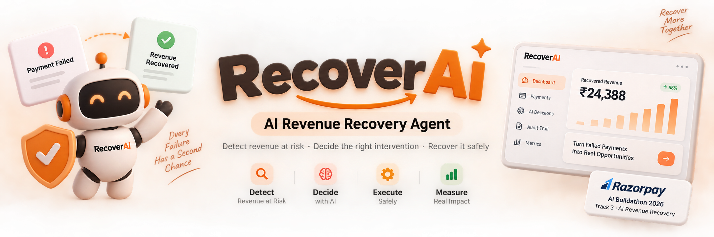

<p align="center">
  
</p>

<p align="center">
  <strong>AI-powered revenue recovery for failed payments</strong>
</p>

<p align="center">
  Detect revenue at risk → Decide the right recovery action → Execute safely → Measure recovered revenue
</p>

<p align="center">
  <a href="https://revenue-recovery-ai-nine.vercel.app/">
    🚀 <strong>Live Demo</strong>
  </a>
</p>


<br>

<p align="center">
  
  
  
  &nbsp;&nbsp;&nbsp;&nbsp;&nbsp;&nbsp;
  
  &nbsp;&nbsp;&nbsp;&nbsp;
  
  &nbsp;&nbsp;&nbsp;&nbsp;
  
  
  
</p>

<p align="center">
  <sub>
    Razorpay&nbsp;&nbsp;•&nbsp;&nbsp;React&nbsp;&nbsp;•&nbsp;&nbsp;Node.js&nbsp;&nbsp;•&nbsp;&nbsp;Gemini&nbsp;&nbsp;•&nbsp;&nbsp;Vercel&nbsp;&nbsp;•&nbsp;&nbsp;Render
  </sub>
</p>

---

# 💰 RecoverAI

## AI Revenue Recovery Agent

RecoverAI is an AI-powered revenue recovery agent built for the **Razorpay AI Buildathon 2026 — Track 3: AI Revenue Recovery**.

When a payment fails, RecoverAI analyzes the payment context, determines the most appropriate recovery strategy, checks the action against deterministic business policies, executes the permitted recovery action, and records the complete result.

The goal is simple:

> **Recover more revenue without blindly retrying payments or giving an AI unrestricted access to payment execution.**

---

# 🚀 Live Demo

### Try RecoverAI

<p align="center">

### 👉 [Open RecoverAI Dashboard](https://revenue-recovery-ai-nine.vercel.app/)

</p>

The frontend is deployed using **Vercel**.

The backend is designed to run as a separate Node.js service and handles:

- Payment analysis
- Gemini AI decisions
- Recovery policies
- Recovery tools
- Audit logging
- Batch processing
- Revenue evaluation

---

# 🎯 The Problem

Failed payments create a major revenue leakage problem.

A payment failure does not always mean the customer is permanently lost.

For example:

```text
Payment Failed
      ↓
Why did it fail?
      ↓
Can it be recovered?
      ↓
What should we do?
      ↓
Retry?
Reminder?
Human review?
Stop?

Traditional systems often use simple retry rules such as:

Payment failed
      ↓
Retry payment
      ↓
Retry again
      ↓
Retry again

This can result in:

Unnecessary payment attempts
Poor customer experience
Repeated failures
Wasted recovery opportunities
No intelligent decision making
Difficult-to-understand recovery history

RecoverAI takes a different approach.

🧠 The RecoverAI Approach

RecoverAI combines AI reasoning with deterministic controls.

Failed Payment
      ↓
Gemini AI
      ↓
Recovery Recommendation
      ↓
Policy Engine
      ↓
Allowed?
   ↙       ↘
 YES        NO
 ↓           ↓
Tool       Block
Execution
 ↓
Result
 ↓
Audit Log
 ↓
Revenue Metrics

The key principle is:

AI recommends. Policy authorizes. Tools execute. Audit records. Metrics measure.

✨ What RecoverAI Does

RecoverAI can:

🔍 Detect payments at risk
🧠 Analyze payment failure context
🤖 Use Gemini to recommend recovery actions
🔄 Retry eligible payments
📩 Send recovery reminders
👤 Escalate uncertain cases to human review
🛑 Stop recovery when further action is not appropriate
🛡️ Enforce deterministic recovery policies
📜 Maintain an audit trail
📊 Measure recovered revenue
⚡ Run recovery across multiple payments
📈 Evaluate recovery performance
🖥️ Product Preview
<p align="center">  </p>
📊 Dashboard

RecoverAI provides a central recovery dashboard containing:

Revenue KPIs
Revenue at risk
Recoverable revenue
Recovered revenue
Remaining revenue
Recovery rate
Recovery Status

The dashboard shows whether the recovery batch is:

ACTIVE
COMPLETED
COMPLETED_WITH_UNRECOVERED
AI Decision Center

For every analyzed payment, the dashboard can show:

Recommended action
AI reasoning
Confidence score
Risk level
Policy decision
Execution result
Recoverable Payments

The dashboard provides a clear view of failed payments that may still be recoverable.

Information includes:

Payment ID
Customer
Amount
Failure reason
Retry count
Previous successful payments
Recovery status
Audit Trail

Every recovery decision is recorded and can be inspected from the dashboard.

🤖 AI Recovery Actions

RecoverAI supports four major recovery decisions.

1. 🔄 Retry Payment

Used when the payment failure is considered potentially recoverable.

Examples:

INSUFFICIENT_FUNDS
BANK_DECLINED
TIMEOUT

The AI considers:

Failure reason
Previous successful payments
Previous retry attempts
Payment amount
Recovery history
2. 📩 Send Recovery Reminder

Instead of immediately retrying a payment, the agent can recommend a customer recovery reminder.

This can be useful when:

The customer has previously succeeded
A retry has already been attempted
The customer may need to take action
Immediate retry is not the best option
3. 👤 Request Human Review

Some payment cases should not be handled automatically.

RecoverAI can escalate a payment when:

The situation is uncertain
The payment is high value
The payment history is limited
The AI confidence is low
A policy requires human intervention
4. 🛑 Stop Recovery

The agent can decide that no additional automated recovery action should be attempted.

This prevents endless recovery attempts.

🧠 How the AI Makes Decisions

RecoverAI does not make decisions using only the payment failure reason.

The agent considers multiple pieces of context.

Payment Context
Payment amount
Failure reason
Retry count
Reminder count
Previous successful payments
Customer history
Example

Consider:

Amount: ₹1,499
Failure: INSUFFICIENT_FUNDS
Retry Count: 0
Previous Successful Payments: 8

The agent may determine:

High recovery potential
        ↓
Recommend retry

Another example:

Amount: ₹4,499
Failure: BANK_DECLINED
Retry Count: 1
Previous Successful Payments: 15

The agent may decide:

Previous recovery attempt exists
        +
High-value payment
        ↓
Recommend recovery reminder

The exact decision is then passed through the policy engine.

🛡️ Safety Architecture

One of the most important design principles of RecoverAI is:

Gemini never directly controls payment execution.

The AI can recommend an action, but it cannot bypass the deterministic policy layer.

                 ┌──────────────────┐
                 │   Payment Data   │
                 └────────┬─────────┘
                          ↓
                 ┌──────────────────┐
                 │    Gemini AI     │
                 │ Decision Engine  │
                 └────────┬─────────┘
                          ↓
                 ┌──────────────────┐
                 │  Policy Engine   │
                 │  Guardrails      │
                 └────────┬─────────┘
                          ↓
              ┌───────────┴───────────┐
              ↓                       ↓
       ┌─────────────┐         ┌─────────────┐
       │   Allowed   │         │   Blocked   │
       └──────┬──────┘         └─────────────┘
              ↓
       ┌─────────────┐
       │ Recovery    │
       │   Tools     │
       └──────┬──────┘
              ↓
       ┌─────────────┐
       │   Result    │
       └──────┬──────┘
              ↓
       ┌─────────────┐
       │ Audit Log   │
       └──────┬──────┘
              ↓
       ┌─────────────┐
       │   Metrics   │
       └─────────────┘

This separation makes the system safer and easier to audit.

🔐 Deterministic Guardrails

RecoverAI uses deterministic policies to constrain AI decisions.

Retry Limit
Maximum retries = 2

If the maximum retry limit is reached:

Retry request
      ↓
Policy Engine
      ↓
BLOCKED
Reminder Limit
Maximum reminders = 3

This prevents excessive recovery reminders.

High-Value Payments

Payments above the configured high-value threshold receive additional scrutiny.

Current prototype threshold:

₹4,000

High-value payments combined with limited customer history can require human review.

Supported Retry Failure Reasons

The prototype allows retry decisions for:

INSUFFICIENT_FUNDS
BANK_DECLINED
TIMEOUT

Other failure reasons may require:

Human Review
or
Stop Recovery
📜 Audit Trail

Every important recovery event is recorded.

A recovery event contains information such as:

Event ID
Timestamp
Payment ID
Customer ID
Amount
Failure Reason
AI Decision
AI Reason
AI Confidence
AI Risk Level
Policy Decision
Policy Reason
Action Executed
Execution Status
Result
Recovered Amount

This provides traceability from:

AI Decision
      ↓
Policy Decision
      ↓
Tool Execution
      ↓
Recovery Result
📈 Revenue Recovery Metrics

RecoverAI does not stop at making AI decisions.

It measures the financial outcome.

The evaluation layer calculates:

Revenue at Risk

Total failed payment value being considered for recovery.

Recoverable Revenue

Revenue that is still eligible for recovery based on the configured rules.

Recovered Revenue

Actual simulated revenue successfully recovered.

Remaining Revenue

Recoverable revenue that has not yet been recovered.

Recovery Rate
Recovered Revenue
────────────────────── × 100
Recoverable Revenue
Additional Metrics

RecoverAI also tracks:

Retry actions
Reminder actions
Human reviews
Stopped recoveries
Policy-blocked actions
Failed recovery attempts
Average AI confidence
Recovery by action type
Audit event count
⚡ Batch Recovery

RecoverAI supports running recovery across multiple failed payments.

Instead of manually analyzing every payment:

Run AI Recovery
       ↓
Analyze payments
       ↓
Generate AI decisions
       ↓
Validate policies
       ↓
Execute allowed actions
       ↓
Record results
       ↓
Update revenue metrics

This demonstrates how the system can operate as an agentic recovery workflow rather than simply being a prediction model.

🔄 Recovery Lifecycle

The complete lifecycle is:

1. Detect
      ↓
2. Analyze
      ↓
3. Decide
      ↓
4. Validate
      ↓
5. Execute
      ↓
6. Record
      ↓
7. Measure
1. Detect

Identify failed payments that may represent recoverable revenue.

2. Analyze

Gemini analyzes the available payment context.

3. Decide

The AI selects one of:

Retry
Reminder
Human Review
Stop
4. Validate

The policy engine checks whether the action is permitted.

5. Execute

Only policy-approved actions reach the recovery tools.

6. Record

The system records the complete decision and execution result.

7. Measure

Revenue recovery metrics are updated.

🤔 Why Is This an AI Agent?

RecoverAI is more than an AI chatbot or classifier.

The agent follows a complete decision-and-action loop:

Observe
   ↓
Reason
   ↓
Choose Action
   ↓
Check Constraints
   ↓
Execute Tool
   ↓
Observe Result
   ↓
Update State

The AI receives payment context, reasons about the best recovery strategy, selects a tool, and the system executes that action only when policy permits it.

This creates a bounded agentic workflow.

🏗️ System Architecture
┌──────────────────────────────────────┐
│             React Dashboard          │
│                                      │
│ KPIs │ Payments │ AI Decisions │ Log │
└──────────────────┬───────────────────┘
                   │
                   ↓
┌──────────────────────────────────────┐
│           Express Backend             │
│                                      │
│ Payment Routes │ Recovery Routes      │
└──────────────────┬───────────────────┘
                   │
          ┌────────┴────────┐
          ↓                 ↓
┌─────────────────┐  ┌─────────────────┐
│   Gemini AI     │  │ Payment Dataset │
│   Agent         │  │     / JSON      │
└────────┬────────┘  └────────┬────────┘
         │                    │
         └─────────┬──────────┘
                   ↓
          ┌─────────────────┐
          │  Policy Engine  │
          └────────┬────────┘
                   ↓
          ┌─────────────────┐
          │ Recovery Tools  │
          └────────┬────────┘
                   ↓
          ┌─────────────────┐
          │  Audit Logger   │
          └────────┬────────┘
                   ↓
          ┌─────────────────┐
          │ Evaluation      │
          │ Service         │
          └─────────────────┘
🧩 Project Structure
recover-ai/
│
├── backend/
│   ├── data/
│   │   ├── payments.json
│   │   ├── audit.json
│   │   └── recoveryBatch.json
│   │
│   ├── src/
│   │   ├── server.js
│   │   │
│   │   ├── routes/
│   │   │   ├── payments.js
│   │   │   └── recovery.js
│   │   │
│   │   └── services/
│   │       ├── aiAgent.js
│   │       ├── recoveryTools.js
│   │       ├── policyEngine.js
│   │       ├── auditLogger.js
│   │       ├── batchService.js
│   │       └── evaluationService.js
│   │
│   ├── .env
│   ├── .gitignore
│   └── package.json
│
├── frontend/
│   ├── src/
│   │   ├── App.jsx
│   │   ├── App.css
│   │   └── main.jsx
│   │
│   ├── package.json
│   └── vite.config.js
│
├── assets/
│   ├── recoverai_readme_header.png
│   └── dashboard.png
│
├── README.md
└── .gitignore
🛠️ Tech Stack
Technology	Purpose
React	Frontend dashboard
Vite	Frontend tooling
Node.js	Backend runtime
Express.js	REST API
Gemini	AI decision engine
JavaScript	Application logic
JSON	Prototype payment/audit storage
Vercel	Frontend deployment
Render	Backend deployment
🧠 AI Layer

RecoverAI uses Google's Gemini model through the Gemini API.

The AI is provided with structured payment context and is instructed to choose from bounded recovery actions.

The available actions are represented as tools:

retryPayment
sendRecoveryReminder
requestHumanReview
stopRecovery

The backend validates the AI's function call before allowing the action to continue.

🔌 API Endpoints
Payments
Get Payments
GET /api/payments

Returns the payment dataset.

Recovery APIs
Get At-Risk Payments
GET /api/recovery/at-risk

Returns payments currently considered at risk.

Analyze Payment
POST /api/recovery/analyze/:paymentId

Runs the AI recovery decision process for a specific payment.

Example:

POST /api/recovery/analyze/P001
Run Batch Recovery
POST /api/recovery/run-batch

Runs the recovery workflow across the recoverable payment batch.

Reset Demo
POST /api/recovery/reset

Resets the demo dataset and recovery state.

Get Audit Trail
GET /api/recovery/audit

Returns recorded recovery events.

Get Audit Summary
GET /api/recovery/audit/summary

Returns summarized audit statistics.

Get Recovery Metrics
GET /api/recovery/metrics

Returns current batch recovery metrics.

Get Evaluation
GET /api/recovery/evaluation

Returns recovery evaluation metrics.

🧪 Example Recovery Scenarios

RecoverAI uses a prototype dataset containing different payment failure scenarios.

Payment	Amount	Failure	Example Recovery
P001	₹1,499	Insufficient Funds	Retry
P003	₹2,499	Bank Declined	Retry
P005	₹1,999	Timeout	Recovery may fail
P006	₹3,299	Insufficient Funds	Reminder
P009	₹599	Unknown	Human Review
P010	₹4,499	Bank Declined	Reminder
P012	₹699	Timeout	Stop / No further retry
P014	₹999	Unknown	Human Review
P015	₹2,799	Insufficient Funds	Reminder

The AI decision is validated against the policy engine before execution.

💵 Prototype Revenue Dataset

The prototype contains:

Total Revenue at Risk
₹25,087
Recoverable Revenue
₹24,388

The remaining amount represents payments that are not currently eligible for automated recovery under the prototype's configured rules.

These values are calculated from the demo dataset and can change when the recovery workflow runs.

🧮 Evaluation

RecoverAI includes an evaluation service to measure whether the recovery agent actually improves revenue outcomes.

The evaluation tracks:

Revenue at Risk
Recoverable Revenue
Recovered Revenue
Unrecovered Revenue
Recovery Rate
Risk Recovery Rate
Retry Count
Reminder Count
Human Review Count
Stopped Count
Policy Blocked Count
Failed Recovery Count
Average AI Confidence
Recovery by Action
Audit Event Count

This makes it possible to evaluate the system based on financial outcomes, not only AI accuracy.

🛑 Failure Handling

A failed recovery attempt does not automatically mean the entire batch is finished.

For example:

Payment
   ↓
Retry
   ↓
Retry Failed
   ↓
Record Failed Attempt
   ↓
Continue Evaluating Other Payments

A failed attempt is therefore recorded separately from terminal outcomes.

Terminal states include:

Recovered
Human Review
Stopped

This prevents a single failed recovery attempt from incorrectly marking the complete recovery batch as finished.

🔒 Security Design

Sensitive credentials are kept on the backend.

The Gemini API key is stored in:

backend/.env

and should never be exposed through the React frontend.

Example:

GEMINI_API_KEY=your_api_key_here

The .env file is excluded from Git using .gitignore.

For production, payment data should also be stored in a proper database rather than local JSON files.

🧪 Local Setup
1. Clone the Repository
git clone https://github.com/Anand-1081/recover-ai.git

Then:

cd recover-ai
2. Install Backend Dependencies
cd backend
npm install
3. Configure Gemini

Create:

backend/.env

Add:

GEMINI_API_KEY=your_gemini_api_key
4. Start Backend
npm start

The backend runs on:

http://localhost:5000

Test it by opening:

http://localhost:5000/

You should receive:

{
  "message": "RecoverAI backend is running"
}
5. Start Frontend

Open a new terminal.

cd frontend
npm install

Create:

frontend/.env

For local development:

VITE_API_URL=http://localhost:5000

Then start Vite:

npm run dev

The frontend will normally be available at:

http://localhost:5173
🌐 Deployment

RecoverAI uses a split deployment architecture.

                 GitHub
                   │
          ┌────────┴────────┐
          ↓                 ↓
       Vercel             Render
          ↓                 ↓
      Frontend            Backend
          │                 │
          └────────┬────────┘
                   ↓
             RecoverAI
Frontend

The React/Vite frontend is deployed on:

Vercel

Production URL:

https://revenue-recovery-ai-nine.vercel.app/

The production environment variable should contain:

VITE_API_URL=https://YOUR-RENDER-BACKEND-URL
Backend

The Express backend is designed to be deployed on:

Render

Render configuration:

Root Directory: backend
Build Command: npm install
Start Command: npm start

Environment variable:

GEMINI_API_KEY=your_gemini_api_key

The backend must use the Render-provided port:

const PORT = process.env.PORT || 5000;

and listen on:

0.0.0.0
📦 Prototype vs Production

RecoverAI currently uses JSON files for the buildathon prototype.

payments.json
audit.json
recoveryBatch.json

This keeps the prototype simple and easy to understand.

For production, the architecture can be upgraded to:

JSON
 ↓
PostgreSQL / Supabase
 ↓
Persistent Payment Data
 ↓
Persistent Audit Trail
 ↓
Production Analytics
🔮 Future Roadmap
Phase 1 — Current Prototype
 Payment risk detection
 Gemini AI decision engine
 Recovery actions
 Deterministic policy engine
 Audit trail
 Batch recovery
 Revenue evaluation
 Recovery dashboard
 Vercel frontend deployment
Phase 2 — Razorpay Test Mode

Planned improvements:

Razorpay Test Mode integration
Real payment objects
Test payment flows
Payment status synchronization
More realistic recovery execution
Phase 3 — Production Data Layer

Replace JSON storage with:

PostgreSQL

or:

Supabase

This would provide:

Persistent storage
Better concurrency
Queryable audit history
Scalable recovery batches
Phase 4 — Advanced Recovery Intelligence

Future AI improvements could include:

Customer-level recovery propensity
Failure pattern detection
Time-of-day optimization
Recovery channel selection
Smarter reminder timing
Customer segmentation
Revenue forecasting
Recovery strategy experimentation
🏆 Razorpay AI Buildathon 2026

RecoverAI was built for:

Razorpay AI Buildathon 2026

Track 3 — AI Revenue Recovery

The project focuses on the core challenge of recovering revenue from failed payments through an AI-powered, bounded recovery workflow.

The design emphasizes:

Detect
  ↓
Decide
  ↓
Act
  ↓
Measure

while maintaining:

Safety
Auditability
Stopping Rules
Human Escalation
Financial Measurement
💡 Why RecoverAI?

Most payment recovery systems focus primarily on:

"Should we retry?"

RecoverAI focuses on a broader question:

"What is the safest and most effective next action for recovering this revenue?"

That action might be:

🔄 Retry
📩 Remind
👤 Escalate
🛑 Stop

The AI makes the recommendation, but deterministic rules remain in control of execution.

🎯 Core Design Principle
        AI
        │
        │ recommends
        ↓
┌─────────────────┐
│ Policy Engine   │
└────────┬────────┘
         │
         │ authorizes
         ↓
┌─────────────────┐
│ Recovery Tools  │
└────────┬────────┘
         │
         │ execute
         ↓
┌─────────────────┐
│ Audit + Metrics │
└─────────────────┘

AI recommends. Policy authorizes. Tools execute. Audit records. Metrics measure.

👨‍💻 Author
Anand

Built for the Razorpay AI Buildathon 2026.

⭐ Support

If you find the project interesting, consider giving the repository a ⭐ on GitHub.